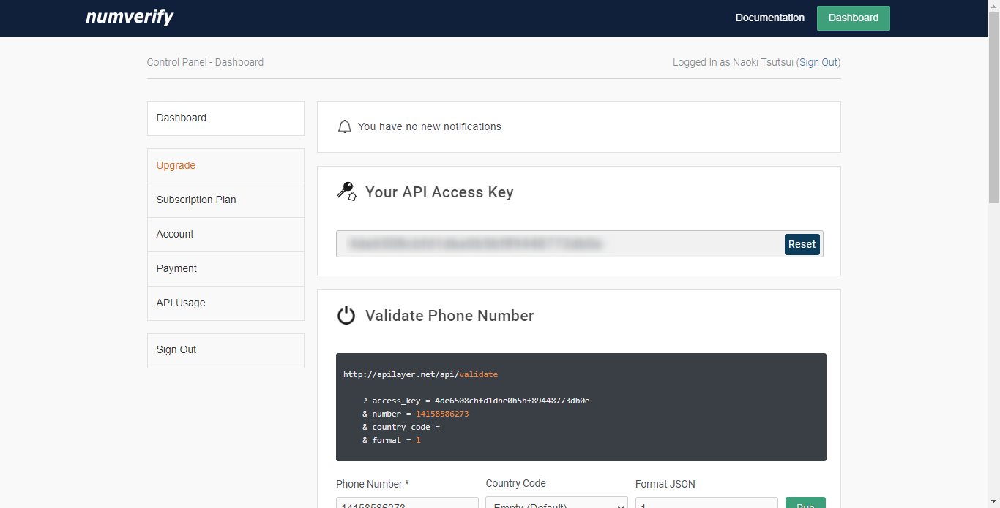

# 簡単プログラミング！その電話番号が実在するかチェックしてみよう

## はじめに

ある電話番号が実在しているのかチェックしたい時があるかもしれません。

そんなときは、「numverify」というAPIサービスを利用してみましょう。
このサービスは世界232ヶ国の電話番号照会を提供しています。
電話番号照会APIを利用するためには、アカウントを作成する必要がありますが、簡単ですのでサクッと作ってしまいましょう。

https://numverify.com/

アカウントを作成すると、ダッシュボードに「Your API Access Key」という項目が表示されています。
この文字列をアクセスキーとして利用します。




## プログラム内容

今回はPythonで記述しています。

```python
import sys
import requests


def main():
    params = {
        "access_key": "Your API Access Key",
        "number": "9455048950",  # 電話番号（ダミー）
        "country_code": "PH",
        "format": 1,
    }
    try:
        r = requests.get("http://apilayer.net/api/validate", params=params)
        print(r.text)
        if r.json()["valid"] == True:
            print("存在します")
        else:
            print("存在しません")
    except:
        print(f"エラー: {sys.exc_info()}")


if __name__ == "__main__":
    main()
```

次の部分を書き換えてご利用ください。

```python
    params = {
        "access_key": "Your API Access Key",
        "number": "9455048950",  
        "country_code": "PH",
        "format": 1, # 1のままでOK
    }
```

## 動作確認

プログラムの実行方法

ターミナルから次のようにタイプしてください。Gitpodで実行する場合も同じです。

> python app.py

プログラムを実行すると、次のような結果がJSONフォーマットで得られます。

注）結果の電話番号は、すべて架空の番号に書き換えてあります。


```json
電話番号が存在する場合
{
  "valid":true,
  "number":"639455048950",
  "local_format":"09455048950",
  "international_format":"+639455048950",
  "country_prefix":"+63",
  "country_code":"PH",
  "country_name":"Philippines (Republic of the)",
  "location":"",
  "carrier":"",
  "line_type":"mobile"
}

電話番号が存在しない場合
{
  "valid":false,
  "number":"6319455048950",
  "local_format":"",
  "international_format":"",
  "country_prefix":"",
  "country_code":"",
  "country_name":"",
  "location":"",
  "carrier":"",
  "line_type":null
}
```


## まとめ

「numverify」というAPIサービスを利用すると、電話番号が実在するかどうかをチェックできる事がわかりました。

気になるあの子に番号もらったけど、本当に実在するのか、どきどきしながら確認するのもいいかもですねｗ。


## 関連情報へのリンク

- [numverify API | Free Phone Number Validation & Lookup API](https://numverify.com/)
- [API Documentation](https://numverify.com/documentation)
- [apilayer/phone-number-validation: Global Phone Number Validation & Lookup JSON API. Real-time REST API supporting 232 countries](https://github.com/apilayer/phone-number-validation)
- [apilayer/numverify-API: Free global phone number validation & lookup JSON API](https://github.com/apilayer/numverify-API)
- [簡単プログラミング！その電話番号が実在するかチェックしてみよう](https://github.com/naoland/nemlog-54017) github
- [簡単プログラミング！その電話番号が実在するかチェックしてみよう](https://nemlog.nem.social/blog/54017) nemlog
